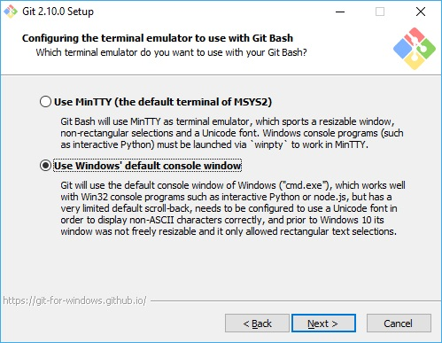

## A git telepítése
A gitet Windowsos telepítőjét letölthetjük innen: https://git-scm.com/download/win
Menjünk végig a telepítő lépésein együtt:

##### Licenszfeltételek elfogadása

Itt elolvashatjuk a git licenszét. Teljesen ingyenes és nyílt forráskodú program, sok meglepetést nem fogunk itt találni.

##### Komponensek kiválasztása

Válasszuk ki a képen látható komponenseket telepítésre. A következők kerülnek beállításra:
- Git Bash Here: Windows Explorerben jobb gombos menüben tudunk git parancssort nyitni.
- Git GUI Here: Windows Explorerben jobb gombos menüben tudunk git GUIt nyitni.
- gitconfig fájlokat összerendeljük a notepaddal
- sh fájlokat összerendeljük Bashhel

##### PATH környezeti változó beállítása

A PATH egy ún. környezeti változó. A parancsok, amik bekerülnek ide bárhonnan futtathatóak.
Itt azt állítjuk be, hogy a git.exe kerüljön be a PATHba.

##### Sorvégződések beállítása

Más operációs rendszerek más karaktert használnak a sortörés (ENTER) jelölésére.
Ez komoly problémákat okozhat olyan projekteken, ahol a fejlesztők több operációs rendszeren dolgoznak.
Itt azt választjuk ki, hogy a git hogyan kezelje a sortöréseket.

##### Parancssor beállítása

Itt azt mondjuk meg a gitnek, hogy a Windows parancssort (cmd) használja.

##### További beállítások

Innen a Git Credential Managert érdemes kiemelni. Ha beállítjuk, nem kell minden egyes művelethez begépelni a felhasználónevünket és a jelszavunkat.

A telepítés befejeztével ellenőrizzük, hogy sikeres volt-e:
- Nyissuk meg a parancssort
- Adjuk ki a git parancsot

Sikeres telepítés után a git "használati utasítását" láthatjuk a képernyőn.

#### Dokumentáció:  
- https://git-scm.com/download/win
- https://git-scm.com/book/en/v2/Getting-Started-Installing-Git
