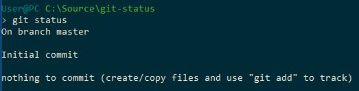
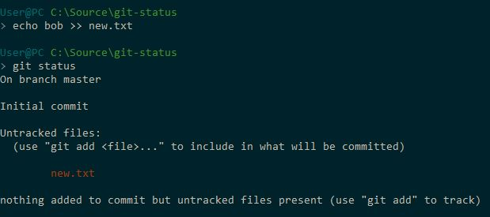
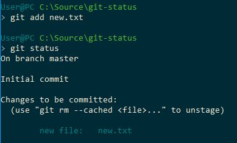
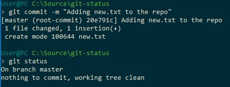
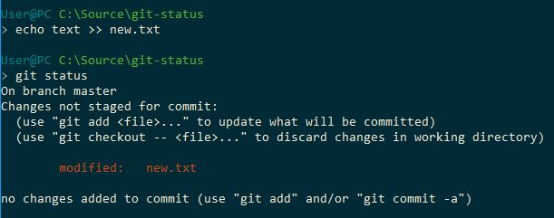
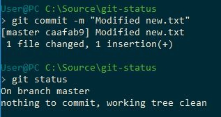

## Repo állapota: status, add és commit
Mielőtt elkezdenénk dolgozni a kódunkon, fontos, hogy megértsük a git hogyan kezeli a változásokat.

Egy fájl négy állapotban lehet a gépünkön:
- Untracked: a git nem törődik a fájllal. Ez újonnan létrehozott fájloknál jellemző.
- Unmodified: a git követi a fájlt, és mi nem módosítottuk azt. Ez az újonnan letöltött fájlok állapota.
- Modified: a git követi a fájlt, és mi módosítottuk.
- Staged: a git követi a fájlt, mi módosítottuk, és a módosítás be fog kerülni az adatbázisba.

#### Státuszváltozások

A fenti kép a különböző fájl státuszokat szemlélteti. Nézzük meg egy újonnan létrehozott repóban ezeket.
A git status parancsot fogjuk használni. Először kiadjuk a parancsot változtatások nélkül:

Ha ezt az üzenetet látjuk megnyugodhatunk. Minden fájl az eredeti állapotában van, és nincsenek új fájlok sem a mappánkban.

Adjunk most hozzá egy új fájlt a repónkhoz!

A git felismerte, hogy létrejött egy új fájl nálunk, de az állapota **untracked**, vagyis ez nem fog bekerülni az adatbázisba.
Nagyon fontos, hogy valamennyi újonnan létrehozott fájlunk untracked lesz, a git csak akkor kezdi el követni, ha erre utasítjuk.

Ezt a **git add** paranccsal tudjuk megtenni.

Kiadva az **add** parancsot a fájl állapota **staged**re változott. Ez azt jelenti, hogy a git elkezdte követni a fájlt, és a következő committal be fog kerülni az adatbázisba.

Próbáljuk most ki a **commit** parancsot!

A **commit** paranccsal véglegesíthetjük a változásokat. Ez a gyakorlatban azt jelenti, hogy minden **staged** állapotban lévő fájlunk bekerül a git adatbázisába.
A git fogja a fájlok aktuális állapotát és eltárolja mint új verziót.

Mint a képen is látszik, a commit után a státuszunk ismét üres.
Módosítsuk a new.txt fájlt, és kérjük le újra a státuszt!

Mivel a new.txt fájl már létezett a repóban, ezért a státusza **modified** lett. Fontos, hogy a módosításokra ugyanúgy le kell futtatnunk az **add** parancsot, mint az új fájlokra, különben nem kerülnek be az adatbázisba.

Most már **staged** a státusza a fájlunknak, a módosításokat tudjuk **commit**olni.

Commit után ismét tiszta állapotba került a repónk.

#### Összefoglalás
A git workflow tehát így néz ki új fájlok esetében:
1. Létrehozunk egy új fájlt
2. **git add** parancssal hozzáadjuk a **staging area**hoz
3. **git commit** paranccsal a **staging area** tartalmát hozzáadjuk az adatbázishoz

Meglévőek esetében pedig így:
1. Módosítjuk a fájlt
2. **git add** parancssal hozzáadjuk a **staging area**hoz
3. **git commit** paranccsal a **staging area** tartalmát hozzáadjuk az adatbázishoz

#### Dokumentáció:  
- https://git-scm.com/book/en/v2/Git-Basics-Recording-Changes-to-the-Repository
- Lokálisan: git status --help
- Lokálisan: git add --help
- Lokálisan: git commit --help